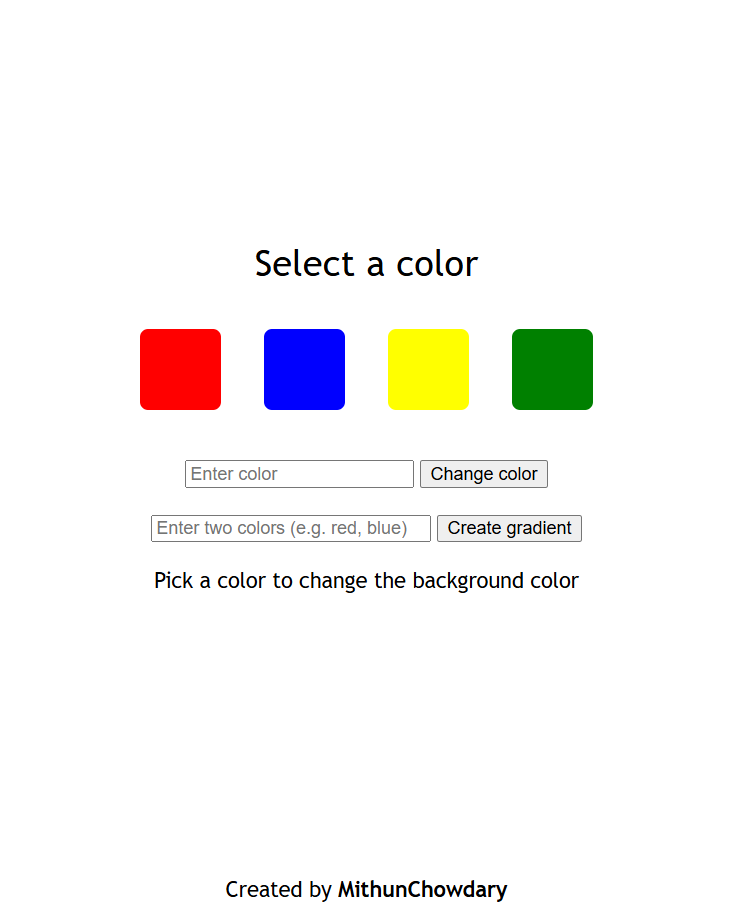

# User can select the color to change the background

## User can enter the required color name as a text and get the color as the background

## Gradient option user can add the two or more colors to create a gradient

